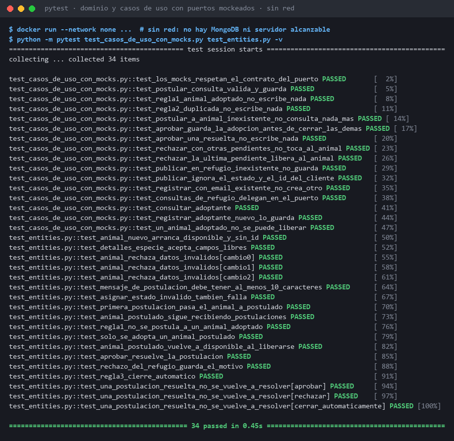
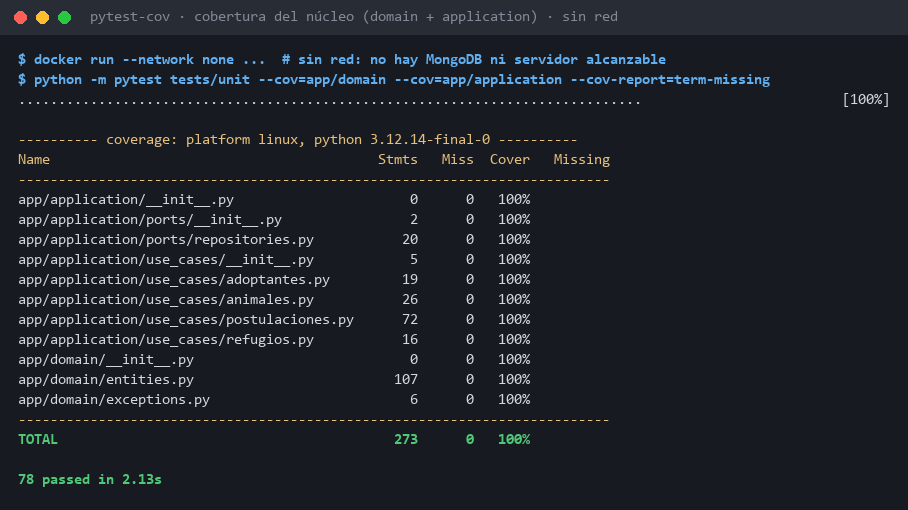

# Evidencia de testabilidad (SCRUM-15)

> Atributo de calidad: **Testabilidad** (ISO/IEC 25010, subcaracterística de Mantenibilidad).
> Referenciada desde la [matriz de atributos de calidad](../../matriz-atributos-calidad.md).

## Qué se quiere demostrar

En Hexagonal, el dominio y los casos de uso dependen de **puertos** (`typing.Protocol`), no de MongoDB ni de FastAPI. Si es cierto, el núcleo se debe poder probar completo **sin base de datos, sin servidor y sin red**, reemplazando cada puerto por un mock.

## Cómo se probó

- **Mocks con la forma exacta del puerto:** cada repositorio es un `AsyncMock(spec=AnimalRepository)`, etc. Si un caso de uso llamara un método que no está en el contrato del puerto, la prueba fallaría.
- **Se verifica la interacción, no solo el resultado:** qué métodos del puerto se llaman, con qué argumentos, en qué orden y cuáles **no** se llaman nunca. Ejemplos:
  - Si la regla 1 o la 2 rechaza la postulación, `guardar()` no se llama: un 409 no deja datos a medias.
  - Al aprobar, el orden de escritura es animal adoptado → aprobación → cierre automático de las demás.
- **Sin red:** las pruebas corren con `docker run --network none`. En ese contenedor no hay forma de llegar a MongoDB ni a ningún servidor, y aun así todo pasa.

Archivos de prueba:
- [`backend/tests/unit/test_casos_de_uso_con_mocks.py`](../../../backend/tests/unit/test_casos_de_uso_con_mocks.py): casos de uso con puertos mockeados (16 pruebas).
- [`backend/tests/unit/test_entities.py`](../../../backend/tests/unit/test_entities.py): reglas de las entidades del dominio (18 pruebas).

## Resultados

### 1. Dominio y casos de uso con puertos mockeados, sin red

34 pruebas en **0,45 s**.



Salida completa: [01-pruebas-dominio-con-mocks.txt](01-pruebas-dominio-con-mocks.txt)

### 2. Cobertura del núcleo (`app/domain` + `app/application`), sin red

Toda la suite unitaria (78 pruebas) en **2,1 s**: **100 %** de las líneas del dominio, los puertos y los casos de uso.



Salida completa: [02-cobertura-nucleo.txt](02-cobertura-nucleo.txt)

## Cómo reproducirlo

Desde `backend/`, con Docker. La primera orden descarga las dependencias; la segunda corta la red:

```bash
docker build -t adopcion-tests -f- . <<'EOF'
FROM python:3.12-slim
COPY requirements.txt requirements-dev.txt /tmp/
RUN pip install -q --no-cache-dir -r /tmp/requirements-dev.txt
WORKDIR /app
EOF
docker run --rm --network none -v "$PWD:/app" adopcion-tests \
  python -m pytest tests/unit --cov=app/domain --cov=app/application --cov-report=term-missing
```

## Lectura para la matriz

| Métrica | Valor |
|---|---|
| Pruebas unitarias del núcleo | 78 (34 de dominio y casos de uso con mocks) |
| Cobertura de `domain` + `application` | 100 % |
| Tiempo de la suite unitaria | ≈ 2 s |
| Dependencias externas necesarias | Ninguna (sin red, sin MongoDB, sin servidor) |

Esto respalda el impacto **✅✅** de Hexagonal sobre la testabilidad: las reglas de negocio (postulación única activa, animal no disponible, cierre automático) se verifican aisladas de la infraestructura, en segundos.
